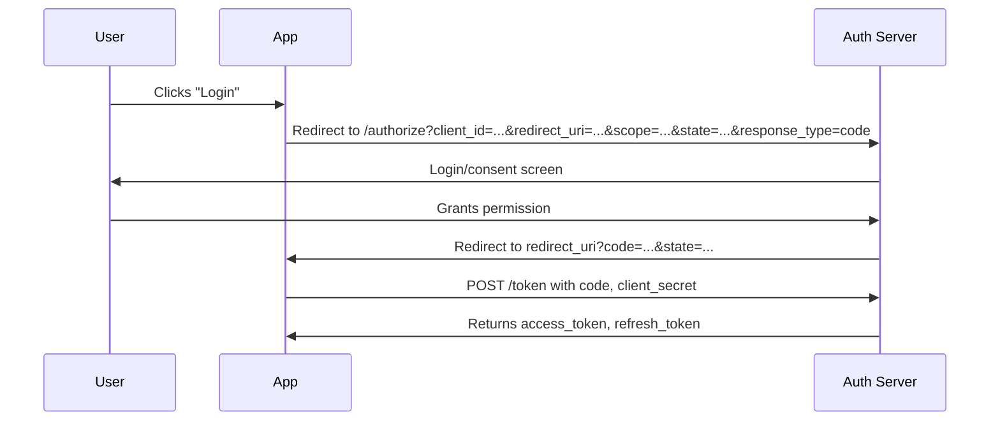

# API Authentication Patterns

## API Keys
```http
# Header (preferred)
Authorization: Bearer sk_live_abc123
# or
X-API-Key: sk_live_abc123

# Query param (less secure, logged)
GET /api/users?api_key=sk_live_abc123
```

### Implementation
```python
# FastAPI example
from fastapi import Security, HTTPException, Depends
from fastapi.security import APIKeyHeader

api_key_header = APIKeyHeader(name="X-API-Key", auto_error=False)

async def verify_api_key(api_key: str = Security(api_key_header)):
    valid_keys = {"sk_live_abc123": "user_123", "sk_test_xyz": "user_456"}
    if api_key not in valid_keys:
        raise HTTPException(401, "Invalid API key")
    return valid_keys[api_key]

@app.get("/api/users")
async def get_users(user_id: str = Depends(verify_api_key)):
    return {"user_id": user_id}
```

### Best Practices
- **Prefix keys**: `sk_live_`, `sk_test_`, `pk_` for identification
- **Store hashed**: `bcrypt` or `sha256` with salt, compare hashes
- **Scope/permissions**: Embed in key or lookup in DB
- **Rotation**: Support multiple active keys per user
- **Rate limiting**: Per-key quotas
- **Expiration**: Optional TTL, revocation list

## JWT (JSON Web Tokens)

### Structure
```
Header.Payload.Signature
eyJhbGciOiJIUzI1NiJ9.eyJzdWIiOiIxMjMiLCJleHAiOjE3MDAwMDAwMDB9.xyz
```

### Header
```json
{"alg": "HS256", "typ": "JWT"}
```

### Payload (Claims)
```json
{
  "iss": "https://api.example.com",    // Issuer
  "sub": "user_123",                    // Subject (user ID)
  "aud": "https://app.example.com",     // Audience
  "exp": 1700000000,                    // Expiration (Unix timestamp)
  "iat": 1699990000,                    // Issued at
  "nbf": 1699990000,                    // Not before
  "jti": "unique-token-id",             // JWT ID (revocation)
  "scope": "read write",                // Permissions
  "roles": ["admin", "user"]            // Custom claims
}
```

### Algorithms
| Algorithm | Type | Use Case |
|---|---|---|
| HS256/HS512 | Symmetric | Simple, shared secret |
| RS256/RS512 | Asymmetric | Public verification, private signing |
| ES256/ES512 | ECDSA | Smaller keys, mobile |
| EdDSA | Ed25519 | Modern, fast, small |

### Implementation (Python)
```python
import jwt
from datetime import datetime, timedelta

SECRET = "your-256-bit-secret"
ALGORITHM = "HS256"

def create_token(user_id: str, scopes: list[str], expires_minutes: int = 60) -> str:
    payload = {
        "sub": user_id,
        "scope": " ".join(scopes),
        "iat": datetime.utcnow(),
        "exp": datetime.utcnow() + timedelta(minutes=expires_minutes),
        "iss": "https://api.example.com",
        "aud": "https://app.example.com"
    }
    return jwt.encode(payload, SECRET, algorithm=ALGORITHM)

def verify_token(token: str) -> dict:
    try:
        payload = jwt.decode(
            token,
            SECRET,
            algorithms=[ALGORITHM],
            audience="https://app.example.com",
            issuer="https://api.example.com",
            options={"require": ["exp", "iat", "sub", "aud", "iss"]}
        )
        return payload
    except jwt.ExpiredSignatureError:
        raise HTTPException(401, "Token expired")
    except jwt.InvalidTokenError as e:
        raise HTTPException(401, f"Invalid token: {e}")

# RS256 (asymmetric)
PRIVATE_KEY = open("private.pem").read()
PUBLIC_KEY = open("public.pem").read()

token = jwt.encode(payload, PRIVATE_KEY, algorithm="RS256")
payload = jwt.decode(token, PUBLIC_KEY, algorithms=["RS256"], ...)
```

### JWT Best Practices
- **Short expiry**: 15-60 min access tokens
- **Refresh tokens**: Long-lived, stored securely (httpOnly cookie), rotatable
- **Validate all claims**: `exp`, `iat`, `nbf`, `iss`, `aud`
- **Algorithm confusion**: Explicitly allow algorithms, never `none`
- **Key rotation**: Support multiple keys via `kid` header
- **Don't store secrets in payload**: JWT is base64, not encrypted
- **Use JWE** if payload must be encrypted

## OAuth 2.0 Flows

### Authorization Code Flow (Web Apps)


```python
# Step 1: Redirect user
@app.get("/login")
async def login():
    params = {
        "client_id": CLIENT_ID,
        "redirect_uri": REDIRECT_URI,
        "scope": "openid profile email",
        "state": generate_random_state(),
        "response_type": "code",
        "code_challenge": pkce_challenge,  # PKCE
        "code_challenge_method": "S256"
    }
    return RedirectResponse(f"{AUTH_SERVER}/authorize?{urlencode(params)}")

# Step 2: Handle callback
@app.get("/callback")
async def callback(code: str, state: str):
    verify_state(state)
    token_response = httpx.post(f"{AUTH_SERVER}/token", data={
        "grant_type": "authorization_code",
        "code": code,
        "redirect_uri": REDIRECT_URI,
        "client_id": CLIENT_ID,
        "client_secret": CLIENT_SECRET,
        "code_verifier": pkce_verifier  # PKCE
    })
    tokens = token_response.json()
    # Store tokens securely
    return RedirectResponse("/dashboard")

# Step 3: Use access token
async def api_call(access_token: str):
    headers = {"Authorization": f"Bearer {access_token}"}
    return httpx.get(f"{API_URL}/user", headers=headers)
```

### PKCE (Proof Key for Code Exchange)
```python
import secrets, hashlib, base64

# Generate verifier (43-128 chars)
verifier = secrets.token_urlsafe(32)

# Challenge = base64url(sha256(verifier))
challenge = base64.urlsafe_b64encode(hashlib.sha256(verifier.encode()).digest()).decode().rstrip("=")

# Include challenge in authorize request
# Include verifier in token request
```

### Client Credentials Flow (Machine-to-Machine)
```bash
curl -X POST https://auth.example.com/token \
  -d grant_type=client_credentials \
  -d client_id=my-client \
  -d client_secret=secret \
  -d scope=read:data write:data
```

### Device Authorization Flow (TV/CLI)
```bash
# 1. Request device code
curl -X POST https://auth.example.com/device_code \
  -d client_id=my-client -d scope=openid

# Response: device_code, user_code, verification_uri, expires_in, interval

# 2. User visits verification_uri, enters user_code

# 3. Poll for token
curl -X POST https://auth.example.com/token \
  -d grant_type=urn:ietf:params:oauth:grant-type:device_code \
  -d device_code=... -d client_id=my-client
```

## Refresh Tokens

### Rotation Pattern (Secure)
```python
# Store: refresh_token_hash, user_id, expires_at, revoked, replaced_by_token_hash

async def refresh_access_token(refresh_token: str):
    token_hash = hash_token(refresh_token)
    stored = await db.fetchrow(
        "SELECT * FROM refresh_tokens WHERE token_hash = $1 AND revoked = false AND expires_at > NOW()",
        token_hash
    )
    if not stored:
        raise HTTPException(401, "Invalid refresh token")
    
    # Rotate: revoke old, issue new
    new_refresh = generate_refresh_token()
    new_refresh_hash = hash_token(new_refresh)
    
    await db.execute(
        "UPDATE refresh_tokens SET revoked = true, replaced_by_token_hash = $1 WHERE id = $2",
        new_refresh_hash, stored["id"]
    )
    await db.execute(
        "INSERT INTO refresh_tokens (token_hash, user_id, expires_at) VALUES ($1, $2, $3)",
        new_refresh_hash, stored["user_id"], datetime.utcnow() + timedelta(days=30)
    )
    
    access_token = create_access_token(stored["user_id"])
    return {"access_token": access_token, "refresh_token": new_refresh}
```

### Token Revocation
```python
# Revoke all user tokens (logout everywhere)
await db.execute("UPDATE refresh_tokens SET revoked = true WHERE user_id = $1", user_id)

# Revoke specific token (logout this device)
await db.execute("UPDATE refresh_tokens SET revoked = true WHERE token_hash = $1", token_hash)
```

## Session/Cookie Auth (Traditional)

### Secure Cookie Settings
```python
response.set_cookie(
    key="session_id",
    value=session_id,
    httponly=True,        # No JS access (XSS protection)
    secure=True,          # HTTPS only
    samesite="lax",       # CSRF protection (strict for high security)
    max_age=3600,         # 1 hour
    path="/",
    domain=".example.com" # Optional: share across subdomains
)
```

### CSRF Protection
```python
# Double-submit cookie pattern
# 1. Set CSRF token in cookie (accessible to JS)
response.set_cookie("csrf_token", token, httponly=False, samesite="lax")

# 2. Require in header for state-changing requests
@app.middleware("http")
async def csrf_check(request, call_next):
    if request.method in ("POST", "PUT", "DELETE", "PATCH"):
        cookie_token = request.cookies.get("csrf_token")
        header_token = request.headers.get("X-CSRF-Token")
        if not cookie_token or cookie_token != header_token:
            return Response("CSRF token mismatch", 403)
    return await call_next(request)
```

## mTLS (Mutual TLS)

### Client Certificate Auth
```nginx
# Nginx config
server {
    listen 443 ssl;
    ssl_verify_client on;
    ssl_client_certificate /etc/nginx/ca.crt;
    ssl_verify_depth 2;
    
    location / {
        proxy_pass http://backend;
        proxy_set_header X-Client-Cert-DN $ssl_client_s_dn;
        proxy_set_header X-Client-Cert-Serial $ssl_client_serial;
    }
}
```

### Python mTLS Client
```python
import httpx

client = httpx.Client(
    cert=("client.crt", "client.key"),
    verify="ca.crt"
)
response = client.get("https://api.example.com/data")
```

## API Gateway Patterns

### Token Introspection (RFC 7662)
```bash
curl -X POST https://auth.example.com/introspect \
  -H "Authorization: Bearer $API_GATEWAY_TOKEN" \
  -d token=$USER_ACCESS_TOKEN

# Response
{"active": true, "scope": "read write", "client_id": "app", "username": "user", "exp": 1700000000}
```

### JWT Validation at Gateway
```nginx
# Kong/JWT plugin, Envoy/JWT filter, AWS API Gateway Authorizer
# Validate: signature, exp, iss, aud, scope
# Forward claims as headers: X-User-ID, X-Scopes, X-Roles
```

## Security Checklist

| Check | Implementation |
|---|---|
| HTTPS only | Enforce TLS 1.2+ |
| Short-lived tokens | 15-60 min access, 30 day refresh |
| Token revocation | Refresh token blocklist + short access TTL |
| Scope validation | Check required scope on each endpoint |
| Rate limiting | Per-user/IP, exponential backoff |
| Audit logging | Log auth events (login, token issue, revoke) |
| Secure headers | `Strict-Transport-Security`, `Content-Security-Policy` |
| Key rotation | Support multiple signing keys via `kid` |
| No tokens in URLs | Use Authorization header only |